# SahayLPG

Web based Government-supervised P2P Emergency LPG support platform with role-based operations, escrow workflow, geospatial contributor discovery, and warden governance.

## Hackathon Context

This project is proposed as a solution for **AMITY UNIVERSITY's NIRMAN 2026 (48-hour Hackathon)**.

### Problem Statement

**5. Community-Based LPG Sharing & Emergency Access Platform**

In crisis situations, some households may have surplus LPG while others face shortages. Build a secure web platform that enables verified users to share or lend LPG cylinders within their community during emergencies, with proper tracking, verification, and safety guidelines.

**Team Dotcode**

- Rahul Dubey
- Dannish Bhardwaj

## What It Solves

SahayLPG helps beneficiaries request urgent LPG support from nearby verified contributors while enforcing:

- identity and role controls (JWT + RBAC),
- KYC governance,
- escrow-backed transaction safety,
- technician verification pipeline,
- warden-level fraud/risk visibility and moderation.

## Core Capabilities

- **Multi-role access:** `BENEFICIARY`, `CONTRIBUTOR`, `TECHNICIAN`, `WARDEN`
- **Emergency flow:** voice/text emergency request parsing + contributor ripple search
- **Geo-matching:** phased radius search with fallback to listed contributors
- **Escrow lifecycle:** lock → verify → handover → calculate/release
- **KYC system:** citizen upload + warden queue + approval/rejection workflow
- **Live operations:** real-time `WARDEN_ALERT` via Socket.IO
- **Compliance/ops tools:** complaint portal, notifications, regional activity feeds
- **Multilingual UX:** English, Hindi, Marathi

## Tech Stack

### Frontend

- React 19 + TypeScript + Vite
- React Router 7, TanStack Query, Zustand
- Axios, React Hook Form + Zod
- Leaflet / React-Leaflet
- Socket.IO client

### Backend

- Node.js + Express
- MongoDB + Mongoose
- JWT + bcrypt authentication
- Socket.IO server
- Decimal.js finance precision
- AI integrations: Gemini + Sarvam (fallback-aware flows)

## High-Level Architecture

```text
Frontend (React/Vite)
	├─ Auth + RBAC guarded routes
	├─ Dashboard flows per role
	├─ Live map + contributor discovery
	└─ Socket.IO listener for WARDEN_ALERT

Backend (Express)
	├─ /api/auth, /api/users, /api/search
	├─ /api/escrow, /api/tech, /api/transactions
	├─ /api/complaints, /api/notifications, /api/emergency
	└─ Services: ripple search, finance math, AI parsing/scoring

Database (MongoDB)
	├─ User, Transaction, KycForm
	├─ Complaint, Notification, Alert
	└─ Geospatial indexing for location-based search
```

## Repository Structure

```text
SahayLPG/
├── backend/        # Express API + business logic + Jest tests
├── frontend/       # React TypeScript client (Vite)
└── screenshots/    # Product screenshots for demo
```

## API Modules (Backend)

Base URL: `/api`

- `POST /auth/register`, `POST /auth/login`
- `GET /users/me`, `PATCH /users/kyc/:id`, `POST /users/kyc-form`, `GET /users/:userId/transactions`
- `POST /search/ripple`, `GET /search/live-map`
- `POST /escrow/lock`, `POST /escrow/calculate`, `POST /escrow/release`
- `PATCH /tech/verify/:transactionId`, `PATCH /tech/handover/:transactionId`
- `GET /technicians/availability`
- `POST /complaints`, `GET /complaints`, `PATCH /complaints/:id/status`
- `GET /notifications`, `PATCH /notifications/read-all`
- `POST /emergency/voice-request`

Detailed gateway contracts are documented in [`backend/backendGateways.md`](backend/backendGateways.md).

## Local Setup

### Prerequisites

- Node.js 18+
- npm
- MongoDB instance (local or cloud)

### 1) Backend Setup

```bash
cd backend
npm install
```

Create `backend/.env`:

```env
PORT=3000
MONGO_URI=mongodb://127.0.0.1:27017/sahaylpg
JWT_SECRET=change_this_secret
CORS_ORIGINS=http://localhost:5173,http://127.0.0.1:5173

# Optional AI integrations
GEMINI_API_KEY=
GEMINI_MODEL=gemini-1.5-flash
SARVAM_API_URL=
SARVAM_API_KEY=
AI_TIMEOUT_MS=9000
```

Run backend:

```bash
npm start
```

### 2) Frontend Setup

```bash
cd frontend
npm install
```

Create `frontend/.env` (optional but recommended):

```env
VITE_BACKEND_TARGET=http://localhost:3000
VITE_API_BASE_URL=/api
```

Run frontend:

```bash
npm run dev
```

Open: `http://localhost:5173`

## Deployment (Vercel Frontend + Render Backend)

### Backend on Render

Create a **Web Service** from the `backend` folder with:

- Build command: `npm install`
- Start command: `npm start`

Set these environment variables in Render:

```env
PORT=3000
MONGO_URI=<your_mongodb_connection_string>
JWT_SECRET=<long_random_secret>
CORS_ORIGINS=https://<your-vercel-domain>

# Optional AI integrations
GEMINI_API_KEY=<optional>
GEMINI_MODEL=gemini-1.5-flash
SARVAM_API_URL=<optional>
SARVAM_API_KEY=<optional>
AI_TIMEOUT_MS=9000
```

Notes:

- Add every allowed frontend origin to `CORS_ORIGINS` as a comma-separated list.
- Include your production Vercel URL and any preview/custom domains if needed.

### Frontend on Vercel

Import the `frontend` folder as a Vercel project.

Set these environment variables in Vercel:

```env
VITE_API_BASE_URL=https://<your-render-service>.onrender.com/api
VITE_BACKEND_TARGET=https://<your-render-service>.onrender.com
```

Recommended framework/build settings:

- Framework Preset: `Vite`
- Build Command: `npm run build`
- Output Directory: `dist`

### Quick Validation Checklist

- Backend health: open `https://<render-service>.onrender.com/api/auth/login` (method should exist; GET may return 404/405, which confirms routing).
- Frontend network calls should target your Render domain, not `localhost`.
- Socket connection should establish to the Render domain.

## Testing

Backend includes **21 Jest tests** (unit + integration) covering auth, RBAC, escrow math/state, ripple search behavior, KYC, technician pipeline, and regional ops.

```bash
cd backend
npm test
```

## Screenshots

### Authentication & Onboarding

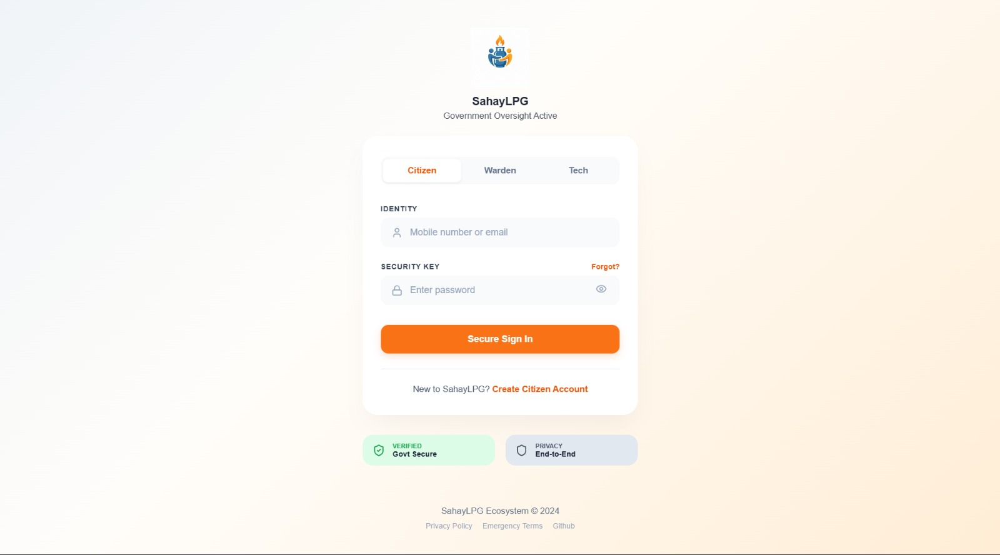
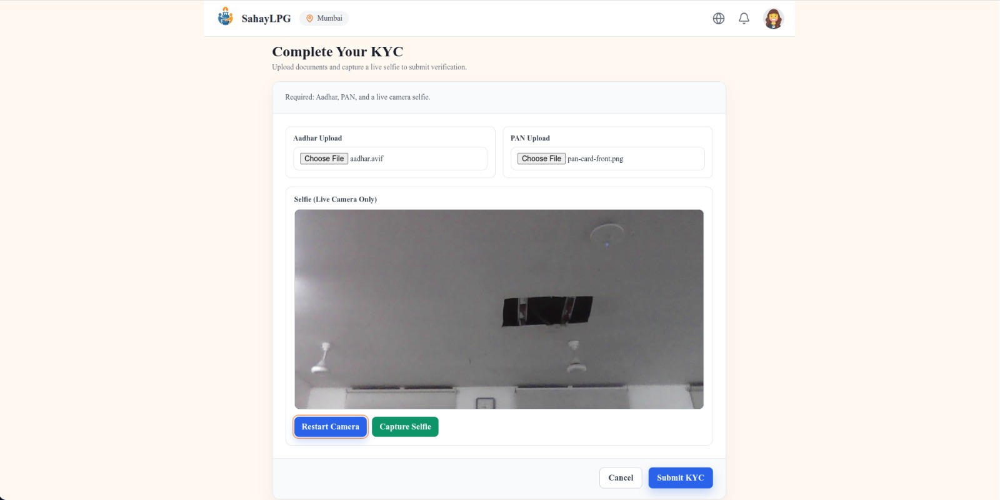

### Citizen Views

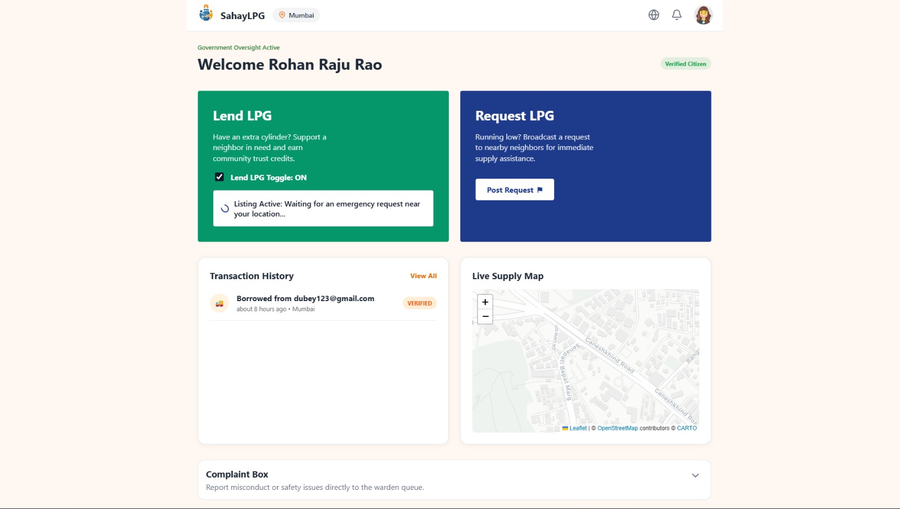

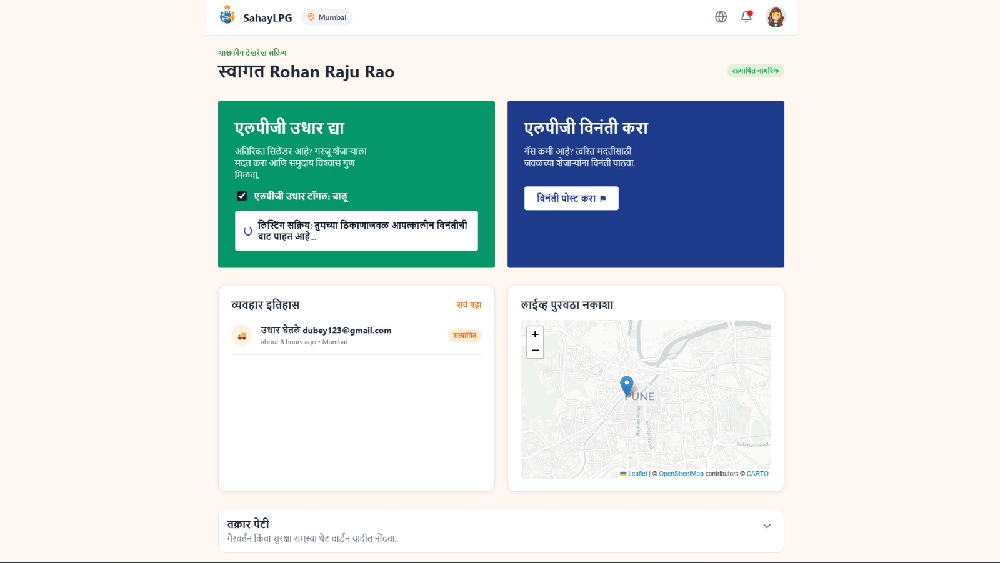
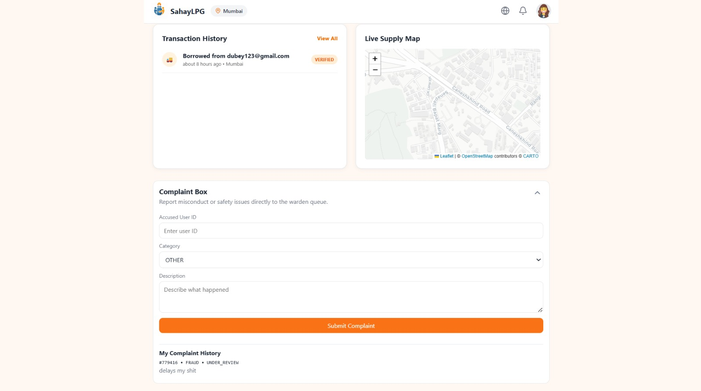
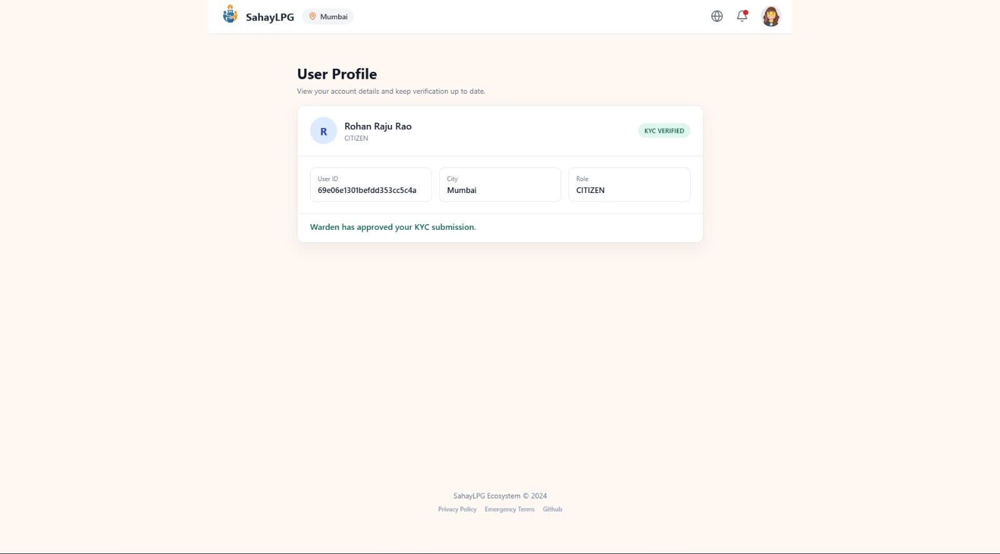

### Technician Views

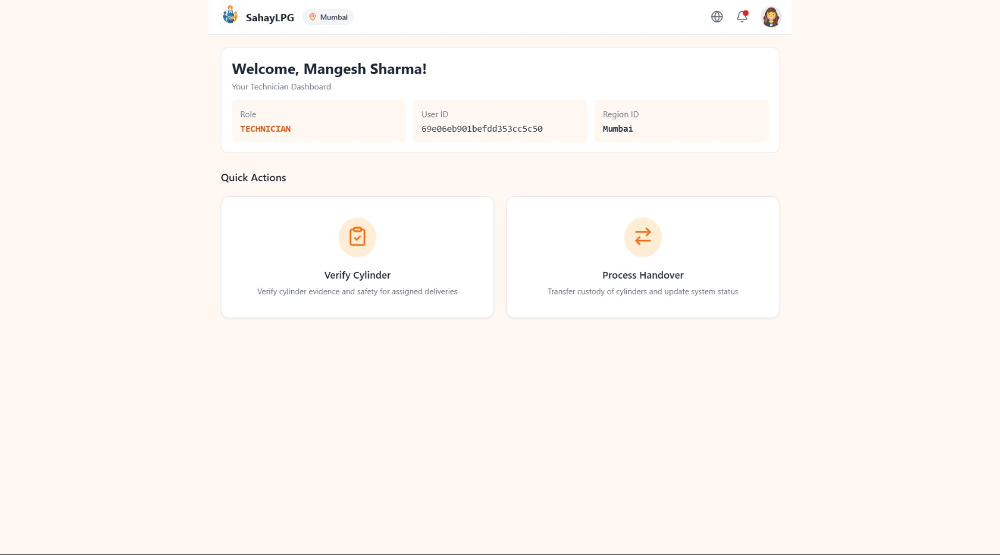
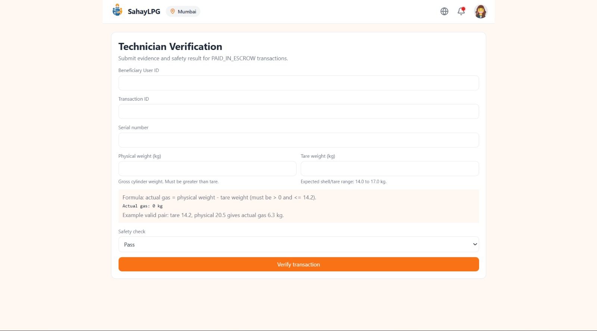

### Warden / Officer Views

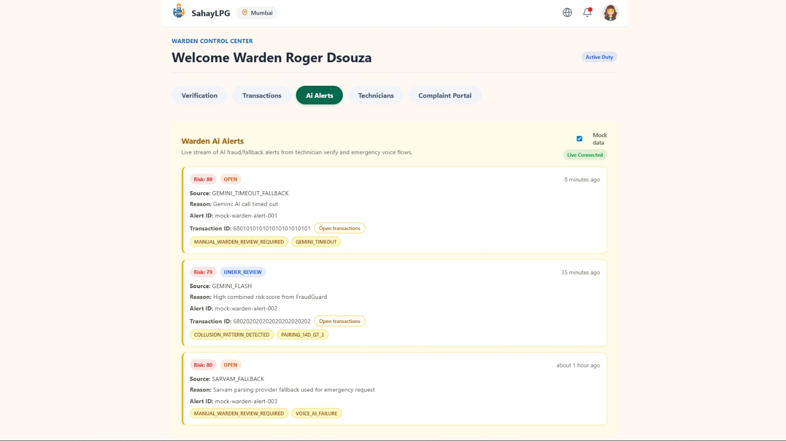
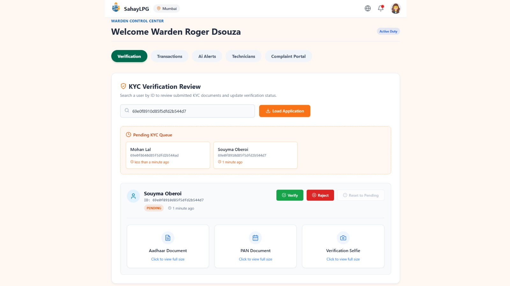
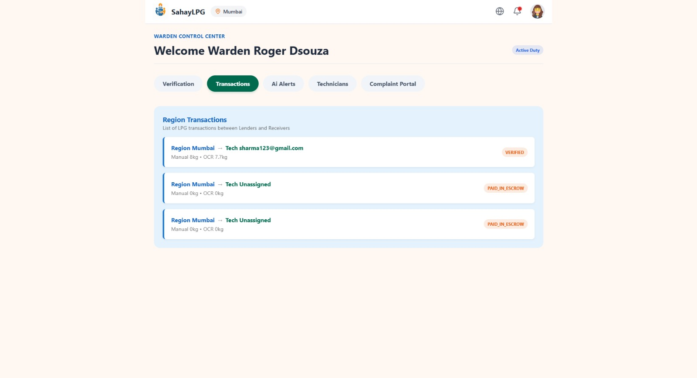
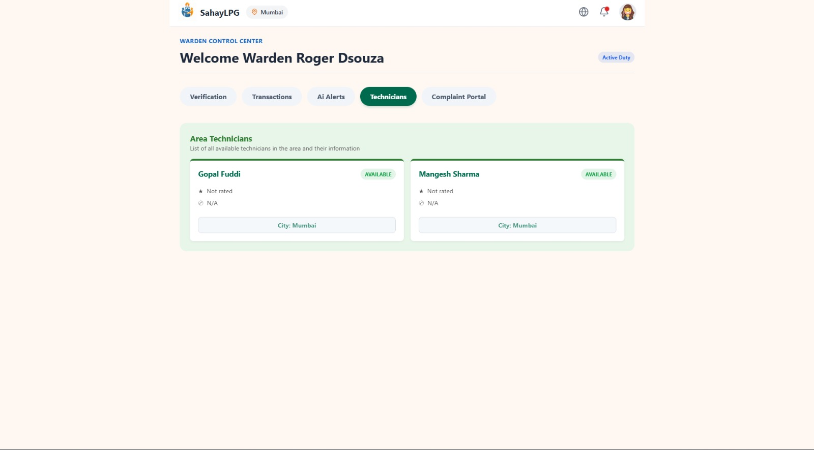
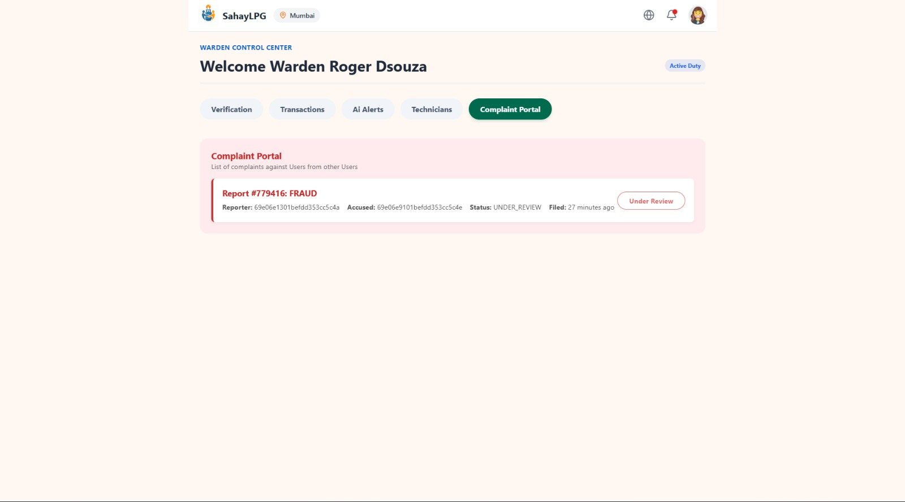
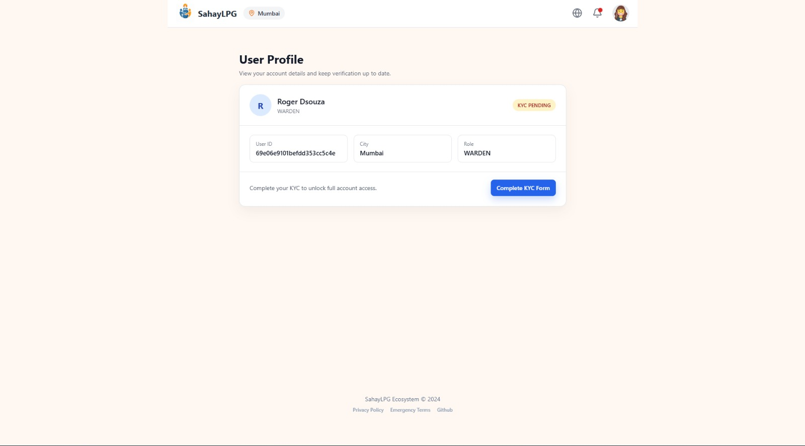

### Notifications

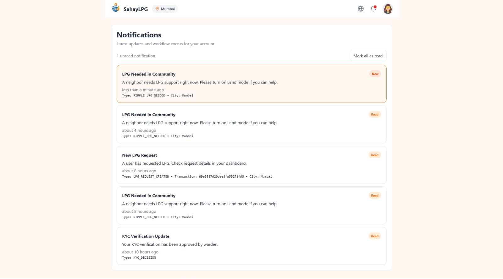

## Notes

- This repository is structured as separate frontend/backend apps.
- `backend/backendGateways.md` contains endpoint-level request/response contracts.
- Socket events are used for live warden alerting from fraud/AI and emergency fallbacks.
